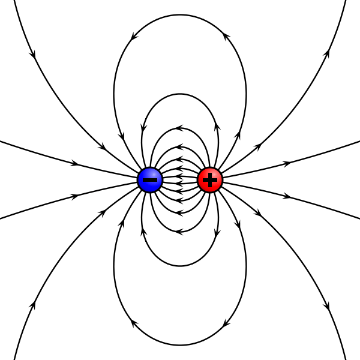
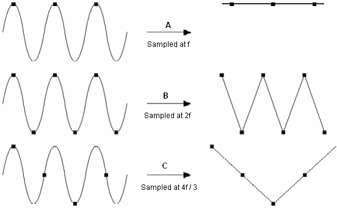
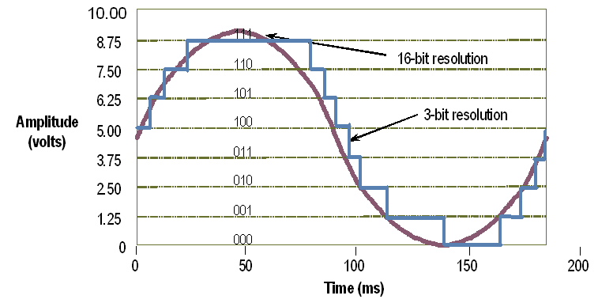
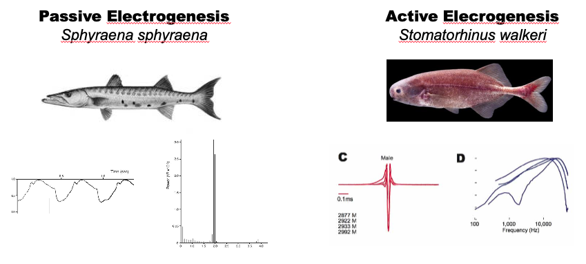

::: {.callout-note title="Questions"}

- What physical quantity are our electrodes actually measuring when we record an EOD?
- How do sampling rate and bit depth limit what we can resolve in a waveform?
- When does AC coupling distort an EOD, and when is it acceptable?
- Why does electrode position affect the measured amplitude of the signal?

:::

::: {.callout-tip title="Objectives"}

- Describe how extracellular differential recording captures the EOD waveform.
- Identify the two key parameters of analog-to-digital conversion and explain how each limits signal fidelity.
- Distinguish AC from DC coupling and select the appropriate mode for a given recording goal.
- List the most common sources of noise in an EOD recording setup and the strategies used to reduce them.

:::

## Introduction

The **electric organ discharge (EOD)** is the behavior we're trying to understand at a cellular and molecular level — but first we need to measure it reliably. Recording an EOD looks simple: put two electrodes in water with a fish and read the voltage. In practice, the choices you make about hardware, positioning, and coupling all change what you observe. This episode gives you the conceptual tools to make those choices deliberately.

This is optional background material. If you are already comfortable with extracellular recording and analog-to-digital conversion, skim the keypoints and move on.

## What We're Measuring

The electric organ acts like a **dipole**: a separation of positive and negative charge across a distance equal to the length of the organ. When the fish fires, hundreds of flat **electrocytes** discharge synchronously, generating an electrostatic field that extends into the surrounding water.

Our electrodes sample the potential difference between two points inside that field. A useful analogy is a topographic map: the density of contour lines represents the steepness of potential change between two nearby points. Two electrodes close together measure a small difference; the same electrodes far apart — spanning more of the gradient — measure a larger one.

{fig-alt="Schematic of an electric fish viewed from above, surrounded by curved dashed lines representing equipotential contours of the dipole field, with arrows indicating the direction of current flow from head to tail."}

This means **electrode spacing must be matched to the fish size and water conductivity**. There is no single "correct" amplitude — only amplitude relative to a known recording geometry.

## How We Measure It

### Electrodes and Amplifier

Standard EOD recordings use three leads: a **positive** (red, anterior), a **negative** (black, posterior), and a **ground** (clear, placed away from the fish). By convention the red lead always goes at the head end. The ground provides a shunt for stray electromagnetic fields picked up by the recording circuit.

The leads connect to a differential amplifier (typically a BMA-200 or AM Systems unit). **Differential mode** amplifies the difference between positive and negative inputs and suppresses signals common to both — a property called **common mode rejection** that is the primary defense against 60 Hz noise.

### Analog-to-Digital Conversion

The amplifier output is an analog voltage. To store it digitally, an **analog-to-digital (A/D) converter** samples that voltage at a fixed rate and encodes each sample as a binary number. Two parameters govern fidelity.

**Sample rate** determines how many voltage measurements are taken per second. A signal is faithfully reconstructed only if it is sampled at more than twice its highest frequency (the Nyquist criterion). Standard mormyrid EODs are well encoded at 100 kHz; very brief species (*Petrocephalus*, some *Paramormyrops*) require 250 kHz or higher.

{fig-alt="Two stacked plots of the same underlying continuous waveform: the upper one sampled densely shows a smooth biphasic shape, the lower one sampled sparsely shows a jagged, distorted reconstruction missing the peaks of the original."}

**Resolution** (bit depth) determines how finely voltage is quantized. A 16-bit converter divides a ±10 V range into 65,536 steps — roughly 0.3 mV per step. To maximize usable resolution, record at the highest amplitude that does not clip.

{fig-alt="Animated comparison of two digitizations of the same waveform: low bit depth produces a coarse staircase that loses fine voltage steps, high bit depth produces a smooth curve nearly indistinguishable from the analog source."}

::: {.callout-warning title="Clipping"}

The BMA-200 has a ±6 V output range. Amplify beyond this range and the waveform will be truncated — **clipped signals cannot be recovered or analyzed**. Always verify gain settings with an oscilloscope before committing a recording session.

:::

### AC vs. DC Coupling

Metal electrodes in water behave like a battery, creating a slow-drifting **DC offset** that can swamp the signal of interest. **AC coupling** removes this offset with a capacitor in the circuit, at the cost of slight distortion at very low frequencies.

Because the EOD carries almost no energy below 20 Hz, AC coupling introduces negligible distortion for most mormyrid species. **DC coupling** is required only when you need to compare baseline potentials or record extremely long-duration waveforms. Sound cards (e.g., Steinberg UR22) always AC couple; National Instruments boards (NI-6211, NI-6216) do not.

{fig-alt="Power spectrum plot with frequency on the x-axis and power on the y-axis. The passive bioelectric trace shows energy concentrated below 20 Hz, while the mormyrid EOD trace has its energy distributed across a much higher frequency band well above the AC-coupling cutoff."}

::: {.callout-warning title="AC coupling and waveform duration"}

Long-duration EODs (some *Campylomormyrus* species, heavily treated fish) can show baseline distortion with AC coupling. If EOD duration is a dependent variable in your experiment, verify AC coupling does not affect your waveform shape before committing to that hardware.

:::

### Noise Sources and Mitigation

The most common noise source is **60 Hz electromagnetic interference** from building electrical systems. Differential amplification and common-mode rejection reduce this substantially, but two additional strategies help.

First, use **shielded cables** (foil or braid) to prevent external fields from being induced in the recording leads. Second, ground the shielding at one point only.

::: {.callout-warning title="Ground loops"}

Grounding shielding at more than one location creates a loop. Magnetic fields can induce a current in that loop that appears as low-frequency oscillation in your recording. If you see rhythmic noise that does not disappear with the amplifier gain at zero, inspect grounding continuity first.

:::

## Practical Recording Guide

1. **Choose your hardware.** AC coupling (sound card) is sufficient for waveform shape and duration. DC coupling (NI-DAQ board) is required for baseline comparisons. Match sample rate to the fastest EOD you expect to encounter.

2. **Set up the electrodes.** Place the red lead at the fish's head and the black lead at the tail. Position the ground well away from the recording zone. Keep all cable runs as short as possible.

3. **Verify with an oscilloscope first.** Before recording a session, confirm the signal is clean and unclipped on an oscilloscope. Adjust gain until the EOD uses most of the amplifier's output range without clipping.

## Keypoints

1. EOD recording measures the potential difference between two points in the extracellular dipole field; electrode spacing directly determines apparent amplitude.
2. Sample rate must exceed twice the highest frequency in the EOD; 100 kHz is sufficient for most mormyrids, but brief species require 250 kHz or more.
3. Bit depth (resolution) limits the smallest voltage step that can be resolved; record at the highest amplitude that does not clip.
4. AC coupling removes DC offset and 60 Hz drift with minimal distortion for standard mormyrid EODs; DC coupling is required when recording long-duration waveforms or comparing baselines.
5. Differential amplification and shielded cables reduce 60 Hz noise; ground shield cables at one point only to avoid ground loops.
