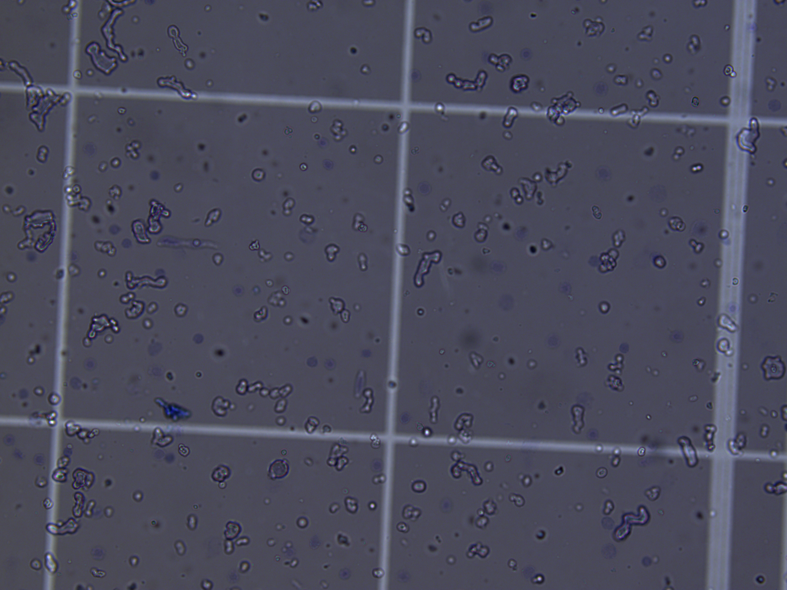
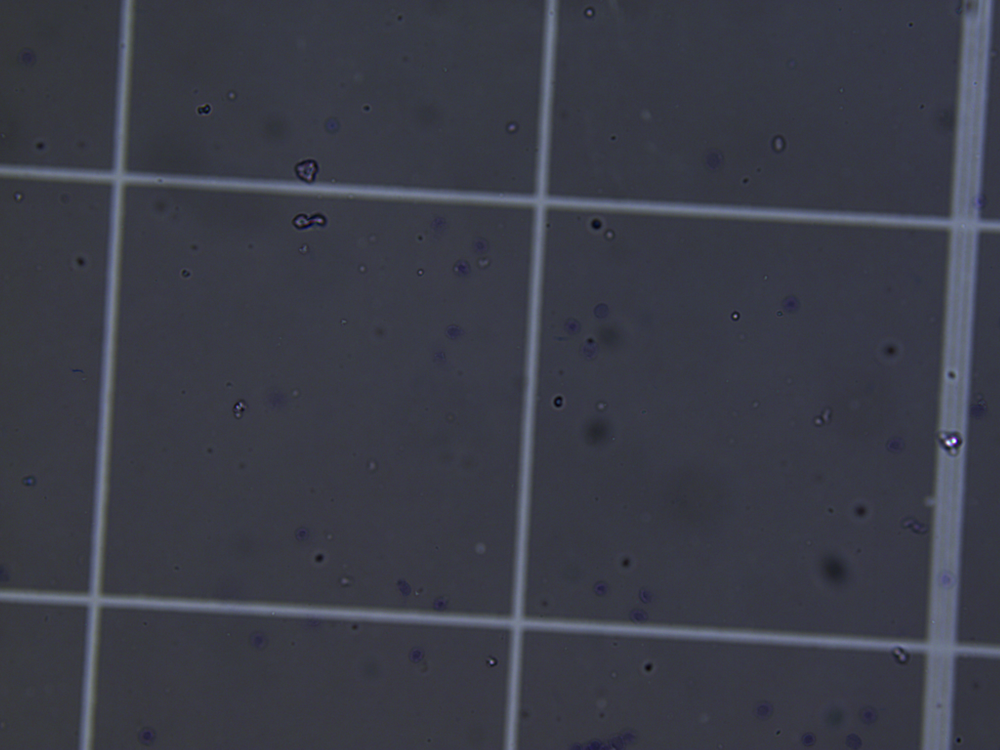

::: {.callout-note title="Questions"}
- Why does snRNA-seq need clean **nuclei** rather than whole cells, and what does that constraint impose on the prep?
- Why does mormyrid **brain** need a different isolation strategy than **electric organ** and **skin**?
- What is the tradeoff between **extraction efficiency** and **recovery**, and why does brain land in a different place on that tradeoff than EO/skin?
- Why do all three tissues share the same reagent backbone (EDTA-free protease inhibition, 5 mM Mg²⁺, 3% BSA), and what would go wrong if any one of those was dropped?
- Why do we count nuclei with **AO/PI fluorescence** rather than trypan blue, and what does each channel actually measure?
- What does a clean prep actually look like under the microscope, and how does the picture differ between brain and electric organ?
:::

::: {.callout-tip title="Objectives"}
- Explain why frozen-tissue snRNA-seq requires nuclei rather than whole cells.
- Identify the tissue-specific debris problem in mormyrid brain (myelin) and in electric organ and skin (extracellular matrix).
- Predict which separation strategy applies to a given tissue: a 1.8 M sucrose cushion for brain, a tissue-clearing filtration step before homogenization for EO and skin.
- Reason about the extraction-efficiency vs. recovery tradeoff and where each tissue currently sits on it.
- Justify the reagent choices shared across all three tissues — EDTA-free protease inhibition, 5 mM Mg²⁺, 3% BSA — from nuclear-envelope biology.
- Interpret an AO/PI count: what the red and green channels mean, and how Extraction Efficiency is computed from them.
- Recognize what a clean mormyrid nuclei prep looks like by eye — pre- vs. post-cushion brain on a hemocytometer, and dirty vs. clean EO on the CellDrop.
- Decide between fresh Chromium loading and banking based on experimental scheduling, not on prep quality.
:::

## Introduction

You have already dissected electric organ, opercular skin, and hindbrain from the fish and flash-frozen each tissue. The transcriptome is locked in. The next problem is mechanical and chemical: get **intact nuclei** out of frozen tissue, free of the debris that defines each tissue type, and into a 10x Chromium chip with their RNA still inside.

This episode is the **conceptual** companion to the three bench protocols you will actually run (linked at the end). It is concerned with *why* the mormyrid brain prep looks nothing like the mormyrid skin prep, *why* both use the same buffers, and *why* the numbers you should expect — extraction efficiency, recovery, nuclei per microliter — differ between tissues. The bench-execution details — exact volumes, stroke counts, centrifuge SKUs — live in the protocols themselves.

::: {.callout-tip title="Scenario"}
Imagine you are planning a snRNA-seq run on three tissues from the same animal: brain, electric organ, and skin. You have one afternoon, one centrifuge, and a finite amount of frozen tissue. The protocols you will execute look superficially similar — Dounce, filter, spin, count — but the steps they share are doing different work in each tissue, and the steps that differ are the ones that decide whether the Chromium chip loads cleanly. Understanding why is what lets you debug a failed prep instead of repeating one.
:::

## Why nuclei, not cells

Single-**cell** RNA-seq fails on most adult tissues that have been frozen, because freezing ruptures plasma membranes. The cytoplasm — and most of the mRNA in it — leaks out before you can run a droplet workflow. The nucleus, by contrast, is a thick double-membrane organelle that survives freezing intact, and a substantial fraction of the transcriptome — newly transcribed RNA, intronic reads, regulatory transcripts — is captured in or around it.

Single-**nucleus** RNA-seq (snRNA-seq) was designed for exactly this situation. Frozen tissue goes in, intact nuclei come out, and the assay reads the nuclear transcriptome. For mormyrids — where animals are sacrificed at the bench and tissues are flash-frozen on the spot — snRNA-seq is the only option that recovers a usable transcriptome from electric organ, skin, and brain in the same workflow.

The cost is that everything downstream depends on nuclei being *clean*. A nucleus prep contaminated with myelin debris or ECM fragments will load poorly on the Chromium chip, drive up ambient RNA in the data, and force you to set quality-control thresholds in the next episode that you would not otherwise need.

::: {.callout-warning title="The debris problem is tissue-specific"}
There is no universal "clean up the nuclei" step. The debris that contaminates a brain prep is chemically and physically different from the debris that contaminates a skin prep. A protocol that works on one tissue will quietly fail on another if you do not adjust for what is actually contaminating that tissue.
:::

## What the three tissues have in common

Every protocol in this module is built around the same backbone: release nuclei from frozen tissue with **mechanical homogenization** in a chilled, low-detergent buffer, then **filter** through Flowmi tip strainers, then **pellet** in a swinging-bucket centrifuge at 4 °C, then **count**. In a production setting the homogenization is done with a glass Wheaton Dounce; in this course we use disposable plastic pestles in a microtube — they are easier to keep RNase-free, harder to break, and good enough for the teaching-scale preps you will run. The reagents are the same across tissues:

- **Nuclei Isolation Media (NIM):** 250 mM sucrose, 25 mM KCl, 5 mM MgCl₂, 10 mM Tris pH 8.0. This is the osmolarity and ionic environment in which mormyrid nuclei survive.
- **Homogenization Buffer:** NIM plus 0.1% Triton X-100 (to disrupt plasma membranes without touching nuclear envelopes), DTT, RNase inhibitor, and EDTA-free protease inhibitor.
- **Blocking Buffer:** 1× PBS with **3% BSA** and RNase inhibitor. Nuclei are sticky after they are stripped of plasma membranes, and BSA prevents them from aggregating with each other or adhering to tube walls.

Three reagent choices are non-negotiable and worth understanding deeply, because every one of them maps onto a specific failure mode if dropped:

::: {.callout-warning title="EDTA-free protease inhibitor — why the formulation matters"}
The buffer carries 5 mM **MgCl₂**, and the nuclear envelope depends on Mg²⁺ for structural stability. Standard cOmplete protease inhibitor tablets contain EDTA, which chelates Mg²⁺ — drop a standard tablet into the buffer and the nuclei lyse during homogenization. The substitution is silent: the buffer looks normal, the prep looks normal until the count, at which point you have a debris suspension instead of a nuclei suspension. Order the EDTA-free formulation specifically and label the bottle.
:::

::: {.callout-warning title="5 mM Mg²⁺ — and why DTT and RNase inhibitor matter too"}
Mg²⁺ stabilizes the envelope; **DTT** reduces disulfide crosslinks that would otherwise lock the tissue into clumps; **RNase inhibitor** protects the transcriptome from the ribonucleases that are released the moment any cellular compartment is disrupted. None of these protect against bad technique, but every one of them is required for *good* technique to actually deliver a clean prep.
:::

::: {.callout-warning title="3% BSA in Blocking Buffer — why nuclei aggregate without it"}
Nuclei that have lost their plasma membranes expose nucleoporins and other surface proteins that stick to glass, plastic, and to each other. BSA coats those surfaces with a protein layer that prevents aggregation and wall adhesion. A prep that looks fine immediately after homogenization but counts low after the wash spin is often a BSA problem — the nuclei stuck to the conical wall during the spin.
:::

## What differs across tissues: the debris problem

The shared backbone gets you from frozen tissue to a particle suspension. The **tissue-specific step** is what separates *nuclei* from the rest of the particles in that suspension. Brain and EO/skin solve the same problem in very different ways because the debris is chemically different.

### Mormyrid brain: the myelin problem

Mormyrid hindbrain is unusually myelin-rich. The Knollenorgan electrosensory pathway, the lateral-line lobe afferents, and the cerebellar valvula all contribute heavy myelinated tracts. After homogenization, that myelin enters the suspension as small lipid-membrane fragments that pellet alongside nuclei in any reasonable wash spin. Left in the prep, the myelin clogs droplet capture on the Chromium chip and shows up as ambient lipid signal in your data.

The solution is a **density step**. Specifically, a **1.8 M sucrose cushion** spun at 13,000 ×g in a fixed-angle rotor. The cushion is strongly hypertonic — nuclei dehydrate during the spin, become denser than their native state, and pellet *through* the cushion. Myelin and lipid debris stay floating on top of the cushion or at the interface. Three layers form: a thin lipid film on top, the sucrose column in the middle, and a small white pellet smeared on the side of the tube (fixed-angle geometry — not at the tip).

::: {.callout-note title="We tried iodixanol first; it failed"}
The canonical Allen Brain Institute SOP uses an iodixanol step gradient (21%/25% layered at 8,000 ×g). In our hands on mormyrid hindbrain, post-gradient recovery dropped to \~15% and extraction efficiency to 41% — the nuclei float above the 25% interface rather than pellet through. The 1.8 M sucrose cushion was adopted from Ruiz Daniels et al. (2023) specifically because it pellets mormyrid nuclei where iodixanol does not.
:::

### Mormyrid electric organ and skin: the ECM problem

Electric organ is built around electrocytes — large, syncytial cells embedded in a dense extracellular matrix (**ECM**) of collagen and basal lamina. Skin sits in an ECM-rich dermis with its own collagen scaffold and patches of subcutaneous fat. The debris that contaminates these preps is not myelin — it is fragmented ECM.

Here a density gradient does not help, because the fragmented ECM has roughly the same buoyant density as nuclei. The solution is to **remove the ECM before it gets fragmented into nuclei-sized pieces**. The way to do this is to be gentle on the front end (release nuclei without shredding the scaffold) and to filter early, while the ECM is still intact and large enough to be caught by a 70 µm mesh. Aggressive homogenization done up front shreds the ECM into fragments that pass straight through the filter and then co-pellet with nuclei — turning a one-spin prep into a debris-heavy mess. Because the bulk of the cleanup happens at the filter rather than at a centrifuge interface, a simple **1,000 ×g wash spin** in a swinging-bucket rotor is sufficient for EO and skin. No cushion, no gradient.

::: {.callout-caution title="Instructor Note"}
The intuition to drive home is: gradients separate by **density**, filters separate by **size**. Brain needs density separation because myelin and nuclei differ in density but not (after fragmentation) in size. EO and skin need size separation because intact ECM is large enough to filter, while fragmented ECM is the same density as nuclei. Students who internalize this will reach for the right tool when they encounter a new tissue.
:::

## The extraction-efficiency vs. recovery tradeoff

Every nuclei prep has two numbers that move in opposite directions:

- **Extraction efficiency** — the fraction of counted particles that are *intact nuclei*, not whole cells or debris. Higher is cleaner.
- **Recovery** — the fraction of the starting nuclei that survive the prep and end up in the final tube. Higher is more efficient.

Push the prep harder (more strokes, higher centrifugal force, longer spins) and extraction efficiency goes up while recovery goes down. Push gentler and the opposite happens. There is no "correct" point on this tradeoff in the abstract — only the point that matches what each tissue actually needs.

| Tissue | Strategy | Extraction efficiency | Recovery |
|----|----|----|----|
| Brain | Homogenize → filter → 1.8 M sucrose cushion at 13,000 ×g | \~90% | \~18% |
| EO / skin | Homogenize gently → filter early → 1,000 ×g wash spin | \>85% | Higher (no cushion losses) |

The brain numbers are the headline cost of running a cushion. \~18% pellet recovery sounds bad — and it is the cleanest mormyrid hindbrain prep we currently know how to make. Higher-recovery alternatives (iodixanol, no cushion at all) deliver suspensions that load poorly on the Chromium chip. Active work is characterizing where the missing 82% goes — wall impact lysis at 13,000 ×g vs. trapping inside the sucrose column — by counting both the pellet and the supernatant after every cushion spin.

::: {.callout-warning title="Low recovery is not a failure mode — plan for it"}
The right response to an 18% pellet recovery is **not** to drop the centrifugal force; that re-introduces the myelin problem the cushion was added to solve. The right response is to **plan tissue input** so that 18% of the pre-cushion count still hits your 5,000-nuclei-per-sample load target. This is why pre-cushion counting exists in the brain protocol but not the EO/skin protocol — for brain, you need the pre-cushion baseline to know whether the cushion run is going to hit target before you spend the time on it.
:::

## Counting nuclei: AO/PI, not trypan blue

Counting is the moment where you find out whether the prep worked. For mormyrid nuclei we use a two-dye fluorescence stain — **acridine orange (AO) and propidium iodide (PI)** — read on a DeNovix CellDrop, instead of the trypan blue / hemocytometer combination that is standard for cell counting. Understanding what each dye does is what lets the readout function as a diagnostic.

**AO** is a small, lipophilic dye that **permeates all membranes** — plasma membrane, nuclear envelope, both. It binds DNA and fluoresces **green**. Every DNA-containing particle in the suspension takes up AO: intact cells, nuclei, and any membrane-bound DNA-positive debris.

**PI** is a larger, charged dye that is **excluded by intact plasma membranes**. It only reaches DNA in particles whose plasma membrane is disrupted — which, for a nuclei prep, is exactly what nuclei are. PI binds DNA and fluoresces **red**. Doubly stained particles (DNA bound by both AO and PI) fluoresce predominantly red via FRET, so the red channel is effectively a nuclei-specific channel.

This is the conceptual payoff:

- **PI⁺ (red) = real nuclei.** Plasma membrane is gone; PI has reached the DNA.
- **AO⁺ / PI⁻ (green only) = intact cells.** Plasma membrane is still intact; PI was excluded.
- **Extraction Efficiency = PI / (AO + PI) × 100** — the fraction of all DNA-containing particles that are actually nuclei.

The CellDrop's Nuclei AO/PI app computes this directly and reports it on the result screen alongside total nuclei concentration (nuclei/mL), intact-cell concentration, mean diameter, and a size histogram.

::: {.callout-warning title="Why not trypan blue?"}
Trypan blue is a brightfield dye and counts anything in the focal plane that looks vaguely round. On a mormyrid prep that is a problem: melanin granules, myelin fragments, and ECM debris all read as "particles" under brightfield and inflate the count. AO/PI is **DNA-specific** — particles without DNA are simply dark in both fluorescence channels, so debris is excluded from the count automatically rather than gated out by eye.
:::

**Quality targets** on the AO/PI count are the same across tissues:

- **Extraction Efficiency ≥ 85%** — ≥ 90% is excellent.
- **Mean diameter 12–14 µm** for mormyrid electrocyte, skin, and brain nuclei.
- **Aggregation \< 5%** on the size histogram (large left-tail beyond \~25 µm indicates doublets and clumps).

::: {.callout-warning title="A low Extraction Efficiency is not a counting problem"}
If Extraction Efficiency comes back below \~70%, the right response is not to re-count — it is to re-Dounce or re-filter the prep. A low EE means there are still intact cells in the suspension, and counting them more carefully will not change that. The fix is upstream, at homogenization or filtration.
:::

::: {.callout-warning title="The count is a diagnostic, not just a number"}
Treat the count as a microscopy session, not a number-recording session. The number on the screen is half of what the count is telling you — the *channel images* are the other half. 1,000 nuclei/µL of crisp, round, sharp-edged red dots is not the same suspension as 1,000 nuclei/µL with green particles smeared across the field and large red blobs that are actually aggregates. The CellDrop saves channel-specific images at export — keep them in the lab notebook alongside the number.
:::

## What good (and bad) preps look like

Numbers on the CellDrop give you Extraction Efficiency and concentration, but the *image* under the microscope is what tells you whether the protocol did the job it was supposed to do. The pairs below come from real mormyrid preps and show what the cushion (for brain) and gentle homogenization + early filtration (for EO and skin) are actually accomplishing.

### Brain: before and after the sucrose cushion

The cushion is the single step that separates a usable mormyrid hindbrain prep from one that will clog the Chromium chip. The transformation it accomplishes is visible by eye on a hemocytometer.

{fig-alt="20x brightfield micrograph of a hemocytometer field showing dense, crowded particulate matter with stringy fragments and small irregular debris, in which discrete nuclei are hard to distinguish from the surrounding myelin debris."}

*Pre-cushion: nuclei are in there, but so is every myelin fragment the hindbrain released during homogenization. Loading this on a Chromium chip would put the lipid debris into droplets alongside the nuclei.*

{fig-alt="20x brightfield micrograph of a hemocytometer field showing a mostly empty grid with a small number of well-separated round particles distributed across the field — a dramatic visual contrast with the dense pre-cushion field."}

*Post-cushion: most of the small particulate debris has been left behind in the cushion supernatant or at the lipid film on top. This is what 18% recovery looks like — fewer particles, but each one is much more likely to be a nucleus.*

::: {.callout-note title="The cushion is doing exactly what it should"}
The post-cushion field looks emptier — that is the point, not a failure mode. The pre-cushion field's crowding was mostly myelin. Removing it is what the protocol is for, and it is the reason we tolerate the recovery cost.
:::

### Electric organ: a dirty prep vs. a clean prep

For electric organ, the contaminant is fragmented ECM rather than myelin. Below is what happens when an early-filtration EO prep does not catch the ECM in time (brightfield, pre-gradient attempt) compared to a clean EO prep counted on the CellDrop with AO/PI.

{fig-alt="Brightfield micrograph of a cell counter chamber dominated by large irregular dark clumps and stringy debris with few discrete round particles, characteristic of a poorly cleaned electric organ prep contaminated with extracellular matrix fragments."}

*Dirty EO prep, brightfield: large dark clumps and stringy debris are fragmented ECM and tissue chunks. Trypan-blue counting on this field would call most of these "particles" and badly overestimate the nuclei concentration — which is exactly the failure mode that drove the switch to AO/PI.*

{fig-alt="Fluorescence micrograph of a CellDrop chamber showing a dark background populated with many discrete sharp-edged red dots (PI-stained nuclei), a small number of green dots (AO-stained intact cells), and a few yellow-green aggregates."}

*Clean EO prep, AO/PI on the CellDrop: hundreds of sharp red dots (nuclei, PI⁺), a small number of green dots (intact cells, AO⁺/PI⁻), and a couple of larger yellow-green aggregates that the size gate will exclude. This is what an Extraction Efficiency ≥ 85% looks like at the channel-image level — most of what you see is red.*

::: {.callout-warning title="A good number does not guarantee a good image — and vice versa"}
The two channel images above are the evidence behind a single Extraction Efficiency number. Always look at both channels before you trust the headline number: a high EE with a field full of debris-shaped red blobs is a different problem than a high EE with crisp round red dots. Save the channel images with the lab notebook entry — they are part of the count, not optional metadata.
:::

## Fresh load vs. bank: a scheduling decision, not a quality decision

At the end of every prep you face the same choice: load the Chromium chip **now**, or freeze the nuclei suspension and load **later**. The protocols call this Option A and Option B. The decision is essentially logistical:

- **Fresh load (Option A).** When you can run the Chromium within the same session as the prep and you have all samples for the pool in hand on the same day, fresh loading is the simplest path. Aim for **1,000–1,200 nuclei/µL** with **5,000 nuclei per sample** as the per-sample contribution to an OCM (on-chip multiplexing) pool.
- **Bank (Option B).** When same-day loading of all pool members is impractical — multi-animal experiments, animals processed over multiple days, instrument scheduling — the right move is to bank each prep cryogenically and thaw the full pool together on Chromium day. Banking quality is similar to fresh quality when done correctly; the banking protocol has its own bench document.

Banking is not a fallback for a bad prep. A prep that does not meet the count targets when fresh will not improve through freezing, and a low-quality banked sample is a low-quality fresh sample at thaw. The decision tree is purely about whether all samples in the pool can be on the chip in the same session.

## Challenges

:::: {.callout-important title="Challenge 1: Match the tissue to the debris and the tool (5 min)"}
For each of the following tissues, predict (a) what the dominant debris will be after homogenization, and (b) which separation strategy you would reach for first — a density step, an early filtration step before debris is fragmented, or neither.

1.  Mormyrid hindbrain
2.  Mormyrid electrocyte
3.  Mormyrid opercular skin
4.  A hypothetical mormyrid liver (not in this course, but reason from biology)

::: {.callout-tip title="Solution" collapse="true"}
1.  **Hindbrain** — dominant debris is **myelin** (Knollenorgan tracts, ELL afferents, valvula). Density step (1.8 M sucrose cushion).
2.  **Electrocyte** — dominant debris is **ECM** (collagen scaffolding around syncytial electrocytes). Gentle homogenization followed by early 70 µm filtration while the ECM is still intact.
3.  **Opercular skin** — dominant debris is **ECM plus subcutaneous fat strands**. Same early-filtration approach, with manual removal of visible fibrous tissue and fat before homogenization.
4.  **Liver** — relatively ECM-light and myelin-free; main contaminants would be lipid droplets and intact hepatocytes. Neither a density step nor an early-filtration workflow is the right first reach; a single homogenization + wash spin with attention to lipid removal would be a reasonable starting point. The general rule: identify the debris first, choose the tool second.
:::
::::

:::: {.callout-important title="Challenge 2: A buffer-prep mistake and its consequences (5 min)"}
A new lab member is making Homogenization Buffer and grabs a standard cOmplete protease inhibitor tablet (with EDTA) instead of the EDTA-free formulation. They notice no difference in the buffer's appearance and add the rest of the components normally. They run a brain prep that afternoon. What does the count look like, and at what step would they first notice something is wrong?

::: {.callout-tip title="Solution" collapse="true"}
- The EDTA chelates the 5 mM Mg²⁺ in the buffer. Without Mg²⁺ the nuclear envelope is unstable, and nuclei lyse during the Dounce homogenization.
- The first count is the **pre-cushion count** (Step 4.5 of the brain protocol). It will come back showing very few intact nuclei and a heavy debris background — the released nuclear contents.
- The earlier this is caught the better. The buffer-prep checklist should call out *EDTA-free* explicitly at the inhibitor step, and bottles of EDTA-free inhibitor should be labeled and stored separately from any standard-formulation stock in the lab.
:::
::::

:::: {.callout-important title="Challenge 3: Read the AO/PI result (5 min)"}
A mormyrid skin prep comes off the CellDrop with: red count 1,150 nuclei/µL, green count 350 cells/µL, mean diameter 13.1 µm, and a size histogram with a small right-shoulder beyond 25 µm.

1.  What is the Extraction Efficiency?
2.  Is the prep loadable on Chromium as-is?
3.  What does the right-shoulder on the histogram indicate, and how would you address it?

::: {.callout-tip title="Solution" collapse="true"}
1.  **EE = PI / (AO + PI) = 1,150 / (1,150 + 350) ≈ 77%.** Below the 85% target, well above the 70% re-Dounce threshold.
2.  **Marginal.** The nuclei concentration is in range (1,000–1,200 nuclei/µL), but EE indicates \~23% of counted DNA-positive particles are still intact cells. For a teaching prep this is acceptable; for a production library it would justify a re-filtration step to lift the EE.
3.  The right-shoulder beyond 25 µm is **aggregation** — doublets and small clumps. Gently pipette-mix the suspension and re-count; if the shoulder persists, the BSA in Blocking Buffer is doing its job poorly (check that it was added) or the suspension was vortexed.
:::
::::

:::: {.callout-important title="Challenge 4: Diagnose a low brain pellet recovery (5 min)"}
Your brain pre-cushion count comes back at 8 × 10⁵ nuclei/µL — normal for the input mass. Post-cushion pellet count comes back at 4% of that pre-cushion baseline, well below the expected \~18%. You saved the cushion supernatant; the supernatant count shows \~70% of the pre-cushion nuclei still intact. What does this tell you about the loss mechanism, and what would you change on the next sample?

::: {.callout-tip title="Solution" collapse="true"}
- Most of the nuclei are sitting in the **supernatant**, not the pellet, and they read as intact. So the cushion is not lysing them — they never made it through. This is a **trapping** failure, not an impact-lysis failure.
- Trapping is usually upstream of the spin: a diluted cushion, a contaminated interface, or sample mixing during layering. Check (in order): (1) was the cushion fresh and at 1.8 M? (2) was the interface visibly clean before the spin, or did the sample mix into the cushion during loading? (3) was the spin time correct?
- Do **not** drop the centrifugal force as a "fix" — lower force reduces wall impact but does not address trapping, and reintroduces the myelin co-pellet problem the cushion exists to solve.
:::
::::

## Keypoints

1.  snRNA-seq requires intact nuclei because plasma membranes do not survive freezing — the nuclear envelope does.
2.  The debris that contaminates a prep is **tissue-specific**: myelin in brain, ECM in electric organ and skin. The separation tool must match the debris.
3.  **Brain** uses a density step (1.8 M sucrose cushion, 13,000 ×g) because myelin and nuclei differ in density. **EO and skin** rely on early filtration while the ECM is still intact and large enough to be caught by a 70 µm mesh.
4.  Every prep trades **extraction efficiency** against **recovery**; brain currently lives at \~90% / \~18% on a cushion, EO/skin live at \>85% / much higher on a simple wash spin. Plan tissue input around the recovery you expect.
5.  EDTA-free protease inhibition, 5 mM Mg²⁺, and 3% BSA are non-negotiable across all three tissues — each maps to a specific failure mode if dropped.
6.  **AO/PI counting** is DNA-specific: PI⁺ red particles are nuclei, AO⁺ green-only particles are intact cells, and Extraction Efficiency = PI / (AO + PI) × 100. This is why we use AO/PI instead of trypan blue on mormyrid preps — melanin, myelin, and ECM are invisible in both fluorescence channels.
7.  An EE below \~70% is a homogenization or filtration problem, not a counting problem. Re-prep upstream rather than re-counting.
8.  The *image* is part of the count, not optional metadata — for brain, a successful cushion looks like a hemocytometer field that has gotten visibly sparser; for EO, a clean AO/PI image is a field of crisp red dots with little green and few aggregates. Save channel images with the lab notebook entry.
9.  Fresh vs. banked loading is a scheduling decision, not a quality decision — banking does not rescue a bad prep.

## Linked bench protocols

The full step-by-step bench protocols (brain sucrose-cushion workflow, electric organ and skin filter workflow, AO/PI counting on the DeNovix CellDrop FLi, and nuclei banking for later Chromium loading) will be distributed on paper at the start of the Thursday wet-lab session.

## References

- Ruiz Daniels R, Taylor RS, Dobie R, Salisbury S, Clark E, Macqueen D, Robledo D (2023). A versatile nuclei extraction protocol for single nucleus sequencing in non-model species. *protocols.io* v4. doi:10.17504/protocols.io.261genwm7g47/v4
- Allen Brain Institute (2025). *Isolation of Nuclei from Brain Tissue Using Gradient Centrifugation for Myelin Depletion for 10x Genomics Platform.* SOP PF0357 v1.2.
- Hodge R (Allen Brain Institute). *Preparation of frozen cryopreserved nuclei for snRNA-seq loading on the 10x Chromium system.* Protocol shared by author.
- Krishnaswami SR, et al. (2016). Using single nuclei for RNA-seq to capture the transcriptome of postmortem neurons. *Nature Protocols* 11(3):499–524.
- Slyper M, Porter CBM, Ashenberg O, et al. (2020). A single-cell and single-nucleus RNA-Seq toolbox for fresh and frozen human tumors. *Nature Medicine* 26:792–802. doi:10.1038/s41591-020-0844-1
- Drokhlyansky E, Smillie CS, Van Wittenberghe N, et al. (2020). The Human and Mouse Enteric Nervous System at Single-Cell Resolution. *Cell* 182:1606–1622. doi:10.1016/j.cell.2020.08.003
- Jiao H, Qi J, Xu Y, et al. (2026). Optimized protocol for nuclei isolation from aquatic fish brain tissue for single-cell genomic assays. *Aquaculture and Fisheries* 11:33–39. doi:10.1016/j.aaf.2024.12.001
